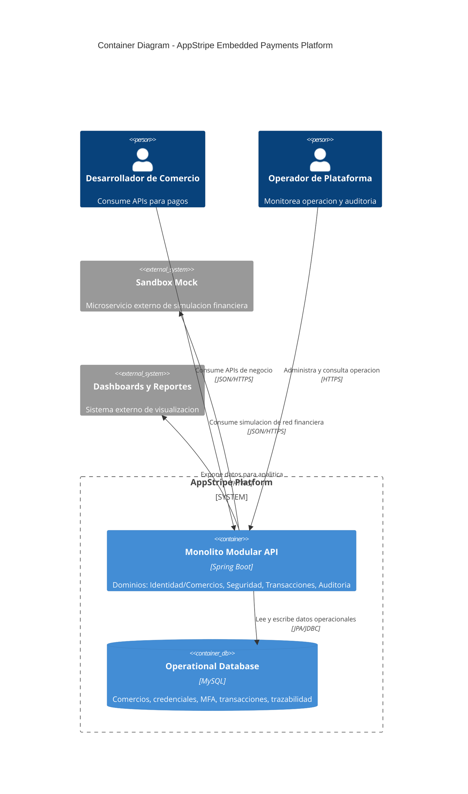

# C4 Level 2 - Container Diagram

Este diagrama representa el sistema objetivo completo en nivel de contenedores.

```mermaid
C4Container
  title Container Diagram - AppStripe Embedded Payments Platform

  Person(merchantDev, "Desarrollador de Comercio", "Consume APIs para pagos")
  Person(platformOps, "Operador de Plataforma", "Monitorea operacion y auditoria")

  System_Ext(sandboxMock, "Sandbox Mock", "Microservicio externo de simulacion financiera")
  System_Ext(dashboards, "Dashboards y Reportes", "Sistema externo de visualizacion")

  System_Boundary(appstripeBoundary, "AppStripe Platform") {
    Container(monolithApi, "Monolito Modular API", "Spring Boot", "Dominios: Identidad/Comercios, Seguridad, Transacciones, Auditoria")
    ContainerDb(mysql, "Operational Database", "MySQL", "Comercios, credenciales, MFA, transacciones, trazabilidad")
  }

  Rel(merchantDev, monolithApi, "Consume APIs de negocio", "JSON/HTTPS")
  Rel(platformOps, monolithApi, "Administra y consulta operacion", "HTTPS")

  Rel(monolithApi, mysql, "Lee y escribe datos operacionales", "JPA/JDBC")
  Rel(monolithApi, sandboxMock, "Consume simulacion de red financiera", "JSON/HTTPS")
  Rel(monolithApi, dashboards, "Expone datos para analitica", "HTTPS")
```
