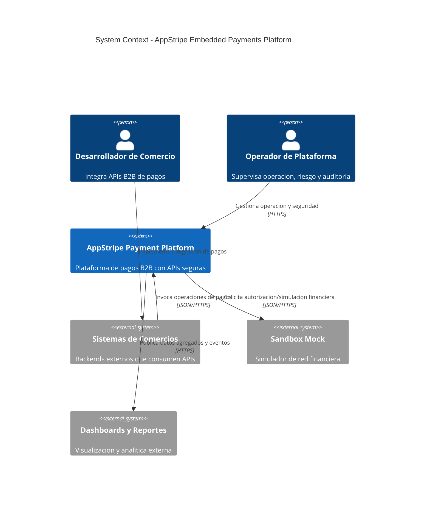

# C4 Level 1 - System Context

Este diagrama refleja el sistema objetivo completo. Incluye sistemas externos sin detallar su implementacion interna.

```mermaid
C4Context
  title System Context - AppStripe Embedded Payments Platform

  Person(merchantDev, "Desarrollador de Comercio", "Integra APIs B2B de pagos")
  Person(platformOps, "Operador de Plataforma", "Supervisa operacion, riesgo y auditoria")

  System(appstripe, "AppStripe Payment Platform", "Plataforma de pagos B2B con APIs seguras")

  System_Ext(merchantSystems, "Sistemas de Comercios", "Backends externos que consumen APIs")
  System_Ext(sandboxMock, "Sandbox Mock", "Simulador de red financiera")
  System_Ext(dashboards, "Dashboards y Reportes", "Visualizacion y analitica externa")

  Rel(merchantDev, merchantSystems, "Implementa integracion de pagos")
  Rel(merchantSystems, appstripe, "Invoca operaciones de pagos", "JSON/HTTPS")
  Rel(platformOps, appstripe, "Gestiona operacion y seguridad", "HTTPS")

  Rel(appstripe, sandboxMock, "Solicita autorizacion/simulacion financiera", "JSON/HTTPS")
  Rel(appstripe, dashboards, "Publica datos agregados y eventos", "HTTPS")
```
