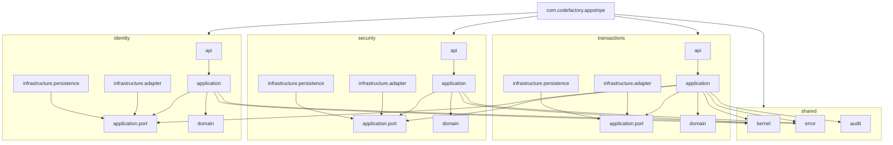
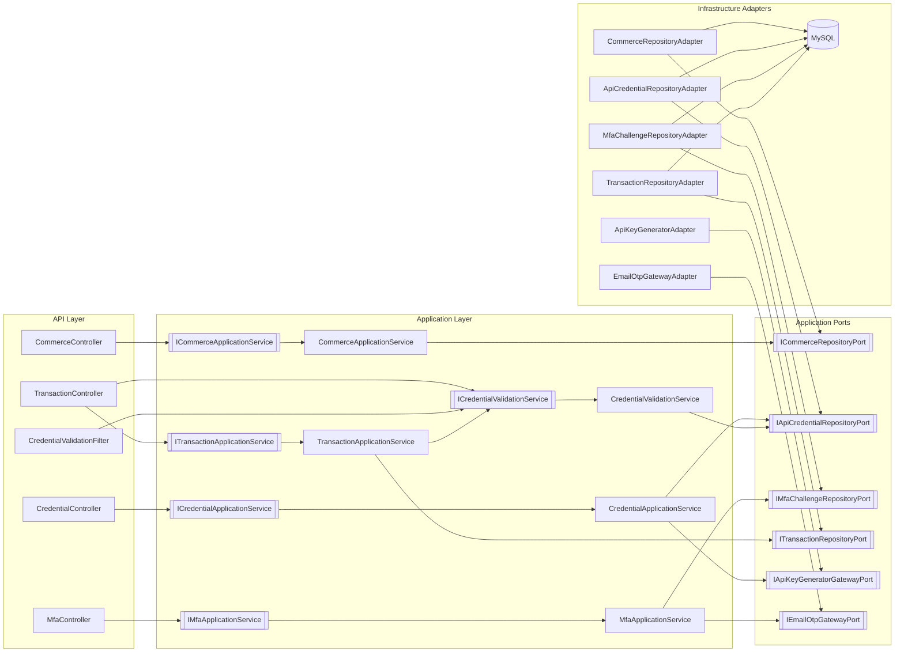

# Sprint 1 - Package and Component Views

Este documento muestra dos capas de verdad:

1. Arquitectura objetivo de Sprint 1 (HU001-HU006).
2. Estado implementado actual del repositorio.

Decisiones confirmadas del sprint:

- Estado inicial de pago: `CREATED`.
- MFA: Email OTP.
- Seguridad transaccional objetivo: API Key + Secret hash.
- Convencion de puertos/adaptadores: `application.port` e `infrastructure.adapter`.

## Package Diagram (Sprint 1)

## Component Diagram with Interfaces (Objetivo Sprint 1)

## Interface Matrix (Sprint 1)

| Interface | Modulo | Responsabilidad | Operaciones iniciales |
|---|---|---|---|
| ICommerceApplicationService | identity | Caso de uso de comercios | registerMerchant, getMerchantById |
| ICredentialApplicationService | identity | Credenciales API por comercio | generateApiCredential, revokeApiCredential |
| IMfaApplicationService | security | Orquestacion de MFA por email OTP | createChallenge, verifyChallenge |
| ITransactionApplicationService | transactions | Orquestacion transaccional | createTransaction, assignInitialStatusCreated, getTransactionById |
| ICredentialValidationService | security | Validacion por solicitud API | validateApiKeyAndSecretHash |
| ICommerceRepositoryPort | identity | Persistencia de comercios | save, findById, existsByBusinessId |
| IApiCredentialRepositoryPort | identity/security | Persistencia de credenciales API | save, findByKeyHash, findActiveByMerchantId, updateLastUsedAt |
| IMfaChallengeRepositoryPort | security | Persistencia de desafios OTP | saveChallenge, findActiveByPrincipal, invalidateChallenge |
| ITransactionRepositoryPort | transactions | Persistencia de pagos | save, findById, existsByIdempotencyKey |
| IApiKeyGeneratorGatewayPort | identity | Generador y hash seguro de credenciales | generateApiKey, generateSecret, hashSecret |
| IEmailOtpGatewayPort | security | Envio de OTP por correo | sendOtpEmail |

## Traceability HU -> Components (Objetivo)

- HU001 Registro de comercio: CommerceController -> ICommerceApplicationService -> ICommerceRepositoryPort.
- HU002 Credenciales API: CredentialController -> ICredentialApplicationService -> IApiCredentialRepositoryPort + IApiKeyGeneratorGatewayPort.
- HU003 Crear transaccion: TransactionController -> ITransactionApplicationService -> ITransactionRepositoryPort.
- HU004 Estado inicial CREATED: TransactionApplicationService.assignInitialStatusCreated.
- HU005 MFA Email OTP: MfaController -> IMfaApplicationService -> IMfaChallengeRepositoryPort + IEmailOtpGatewayPort.
- HU006 Validacion por solicitud: CredentialValidationFilter/TransactionController -> ICredentialValidationService -> IApiCredentialRepositoryPort.

## Estado implementado actual

Componentes implementados:

- `CommerceController` (`POST /api/v1/merchants`)
- `CredentialController` (`POST /api/v1/credentials/generate`)
- `TransactionController` (`POST /api/v1/transactions`, `GET /api/v1/transactions/{id}`)
- `AuthController` (`POST /2fa/verify`)
- `CommerceApplicationService`, `CredentialApplicationService`, `TransactionApplicationService`, `TwoFactorService`
- Adapters y repositorios JPA para `merchants`, `api_credentials`, `transactions`
- Contrato global de errores (`GlobalExceptionHandler`, `ErrorResponse`)

Brechas activas frente al objetivo:

- Aun no se aplica validacion de API credential en endpoints de transacciones.
- No hay `CredentialValidationFilter` activo en runtime.
- MFA productivo completo (challenge por email OTP) no esta cerrado end-to-end.

## APIs actuales del backend

| Metodo | Ruta | Estado |
|---|---|---|
| POST | `/api/v1/merchants` | Activa |
| POST | `/api/v1/credentials/generate` | Activa |
| POST | `/api/v1/transactions` | Activa |
| GET | `/api/v1/transactions/{id}` | Activa |
| POST | `/2fa/verify` | Activa |
